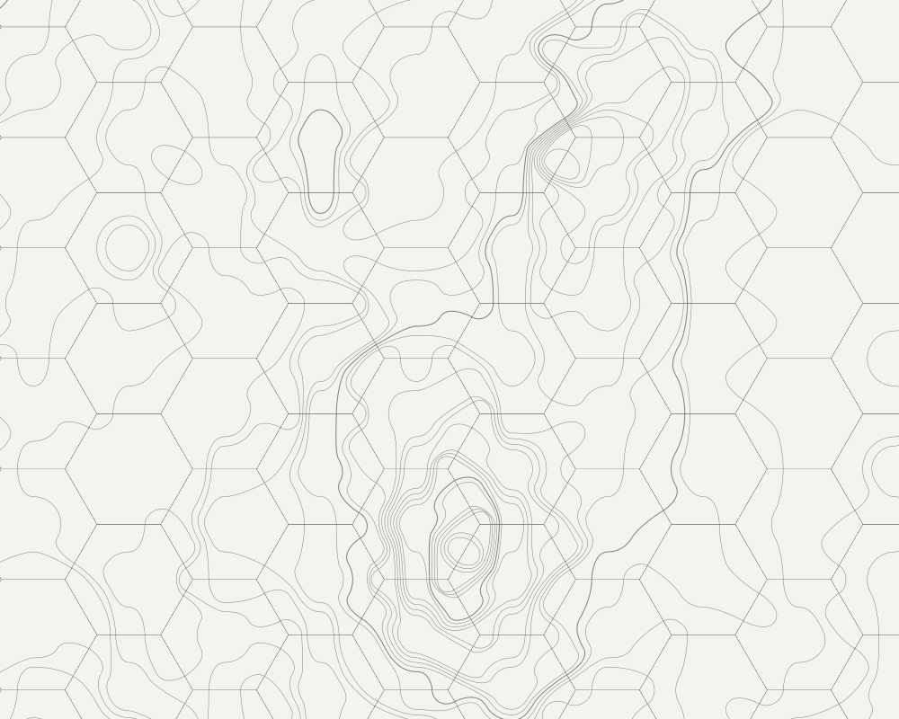
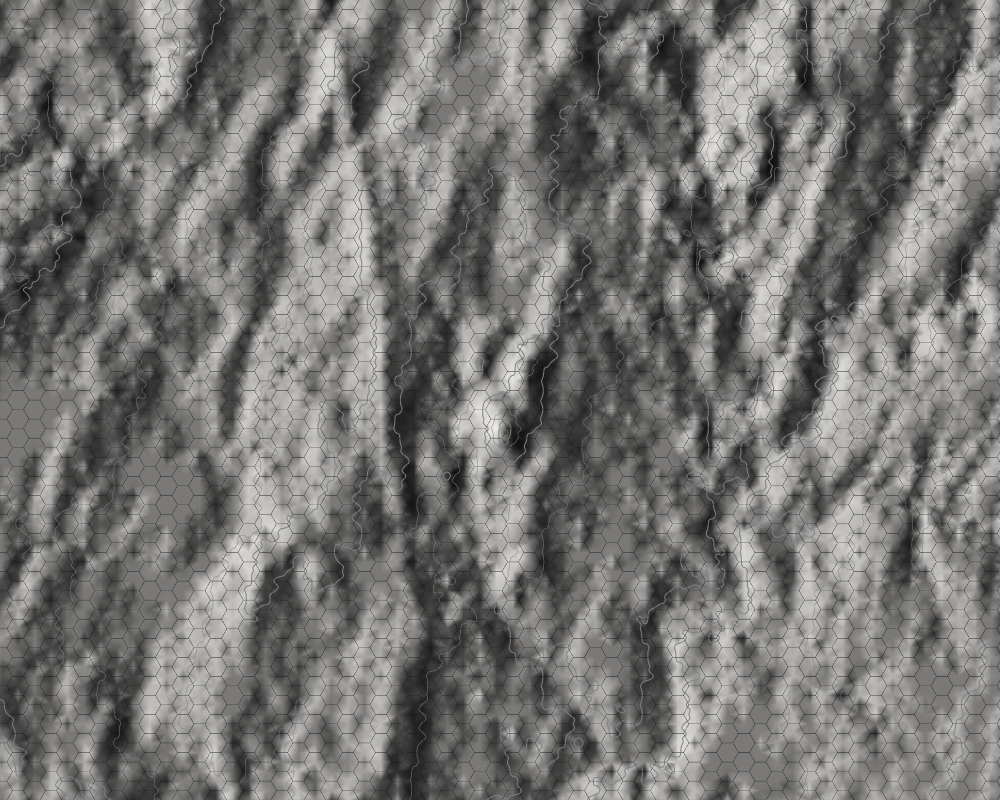

A study into dynamically rendered vector graphics.

Simple instructions:
- You'll need a black and white 8-bit PGM format image named "getty.pgm" in same folder as code
- Start your Lisp
- (load "load.lisp")
- (in-package :hexhammer)
- (test)

A view of Round Top & Little Round Top at Gettysburg.

Same location but zoomed out and rendered with Gouraud shading.

